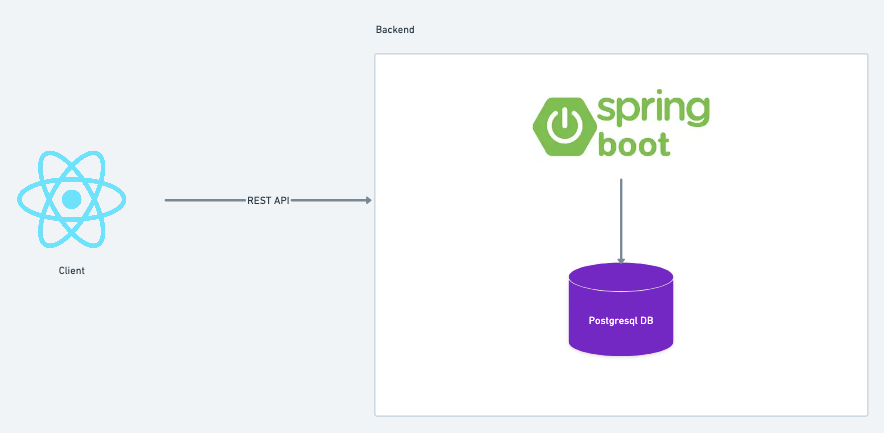

# Kivabi - Fullstack Project Management & Notes Application

## Overview
Kivabi is a modern fullstack application for project management and notes organization built with cutting-edge technologies.

## High Level Architecture

## Technical Architecture

### Technology Selection Rationale

#### Why React.js for Frontend?
- **Component-Based Architecture**: Enables reusable UI components for consistent user experience
- **Strong Ecosystem**: Vast library ecosystem and community support for rapid development
- **Performance**: Virtual DOM ensures efficient rendering and optimal performance
- **Developer Experience**: Hot reloading with Vite provides excellent development workflow
- **Job Market Demand**: High industry adoption with abundant talent pool
- **Progressive Enhancement**: Can start simple and scale to complex SPA requirements

#### Why Spring Boot with Java for Backend?
- **Enterprise Readiness**: Battle-tested framework for production-grade applications
- **Strong Typing**: Java's static typing reduces runtime errors and improves code quality
- **Spring Ecosystem**: Comprehensive suite of tools (Security, Data, Boot) for full-stack development
- **Performance**: JVM optimization and Just-In-Time compilation for high performance
- **Security**: Built-in security features with Spring Security and proven authentication patterns
- **Scalability**: Excellent support for microservices and horizontal scaling patterns
- **Long-term Stability**: Backward compatibility and long-term support from Oracle/Spring
- **Database Integration**: Superior ORM with Spring Data JPA and transaction management

### Backend (kivabi-service)
- **Framework**: Spring Boot 3.5.7
- **Database**: PostgreSQL
- **Authentication**: Spring Security + JWT Token
- **API Documentation**: Swagger/OpenAPI
- **Supporting Technologies**:
  - Spring Data JPA for ORM
  - Spring Validation for data validation
  - Mapstruct for object mapping
  - Lombok to reduce boilerplate code

### Frontend (kivabi-frontend)
- **Framework**: React 19.2.0
- **Build Tool**: Vite
- **Routing**: React Router DOM
- **Styling**: CSS Modules

## Main Features

### Project Management
- Create, read, update, and delete projects
- Project organization with clear structure

### Notes Management
- Notes system integrated with projects
- CRUD operations for notes
- Note categorization by project

### Authentication & Authorization
- User registration and login
- JWT-based authentication
- Role-based access control

### API Features
- RESTful API design
- Comprehensive error handling
- Input validation
- Swagger documentation

## Database Structure
- **User**: User information and credentials
- **Project**: Project data with metadata
- **Notes**: Notes associated with specific projects

## Deployment & Development
- **Containerization**: Docker and Docker Compose
- **CI/CD**: GitHub Actions workflow
- **Development**: Hot reload with Vite (frontend) and Spring DevTools (backend)

## Security
- Password hashing with BCrypt
- JWT token authentication
- Input validation and sanitization
- CORS configuration

## Scaling Considerations

### Database Connection Pool Optimization
- **Hikari Connection Pool**: Configured for optimal performance at scale
- **Pool Sizing**: Adjustable based on database capacity and user load
- **Connection Management**: Efficient connection reuse and timeout handling

### Horizontal Scaling Strategy
- **Load Balancer Ready**: Stateless JWT authentication enables horizontal scaling
- **Multiple Instances**: Support for deploying behind NGINX, AWS ALB, or Kubernetes Ingress
- **Container Orchestration**: Compatible with Docker Swarm/Kubernetes for automatic scaling

### Performance Optimization
- **Database Indexing**: Optimized indexes for frequently queried tables
- **Query Optimization**: Monitoring and optimization of slow database queries
- **Caching Strategy**: Redis integration ready for frequently accessed data

This application is designed to provide a smooth experience for managing projects and notes with an intuitive interface and robust API, with architecture capable of scaling from 1,000 to 100,000+ users.

## Related Documentation

- [Audio to Text Feature Documentation](./audio-to-text.md)